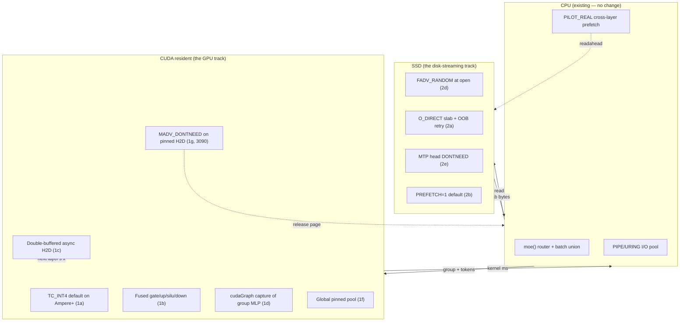

# Plan — colibrì CUDA & SSD-streaming optimization

## Goal

Push the **resident CUDA expert tier** and the **disk → RAM → VRAM streaming
path** forward on a single, opinionated roadmap. Two constraints from the
README bound every step:

- **Compute is no longer the ceiling on most datapoints.** With AVX-512/VNNI
  CPUs the AVX-512 matmul already meets a 5090; [#101](https://github.com/JustVugg/colibri/issues/101)
  showed the **CUDA expert tier ≈ 0%** on a 9800X3D. The wins live in
  kernel quality, async/IO overlap, and resident-data placement.
- **Cold decode is disk-bound.** [#120](https://github.com/JustVugg/colibri/issues/120)
  shipped `1.23 tok/s` on PCIe Gen5 by *trimming* disk work (`DIRECT=1`,
  `PIPE_WORKERS=16`, `PREFETCH=1`, MTP off). The marginal disk byte is
  the most expensive byte in the engine.

So this plan is **disk-first, kernel-second, sync-third**. The previous
Claude passes that already shipped:

- `i4_acc512` AVX-512 FMA tree (decode +4–7% on routing-CPU-heavy runs)
- PIPE/PILOT/PILOT_REAL/URING async expert I/O with io-wq bound
- `direct` `O_DIRECT` slab reads (cold → 8.8 GB/s on 9100 PRO)
- TC int4 (`grouped_s4_wmma`) and TC W4A16 (`w4a16_matmul` / `w4a16_gate_up`)
- One stream per device, thread-local `cudaSetDevice` cache
- `pipe_layer_sparse` keeping residual on the device across a whole layer
- `cuda_expert_group` PIPE1b for batch-union MoE on prefill
- `kv_b_shard` head-shard path (opt-in)
- `pilot_uring_batch` value-preserving cross-layer prefetch
- `expert_host_release` so VRAM-tier experts don't double-bill RAM
- `pipe_silu_mul`, `pipe_rmsnorm`, `pipe_rope`, `pipe_add` device kernels
- `attention_absorb_batch_dev` / `attention_project_batch_dev` / `_dev_out`
- `pipe_peer_copy` for P2P broadcast of latent/rope

**Everything below is what is left, not what already shipped.** I've
double-checked each item against the source rather than trust the
narrative. The honest version: a lot of the obvious wins are already
done. The remaining wins are deeper and more specific.

## Constraints (driven by the engine, not by opinion)

| Constraint | Source | Effect on the plan |
|---|---|---|
| Engine is `O_DIRECT` raw int4 nibbles with per-row scales | [`c/glm.c:1716`](c/glm.c:1716) and [`c/st.h:101`](c/st.h:101) | All CUDA kernels must consume `nibbles XOR 0x88` (offset-to-signed-4); can't switch to a vendor INT4 layout (cuBLAS int4) without a re-quant or a transpose. |
| O_DIRECT requires 4 KiB alignment; the slab path reuses one 16 KiB-aligned `posix_memalign` | [`c/glm.c:1730-1747`](c/glm.c:1730) | Slab layout is a single contiguous region per expert; we can move bytes, not the layout, without re-allocating per layer. |
| Engine uses one CPU thread pool for I/O (URING) and one OMP team for matmul; no producer/consumer thread for math | [`c/glm.c:5860`](c/glm.c:5860), [`c/uring.h:88`](c/uring.h:88) | CUDA work must not introduce a 2nd producer thread; use a small fixed thread pool (or the existing OMP team for host math + the CUDA stream for device math). |
| The `TC_INT4` path is opt-in (`COLI_CUDA_TC_INT4=1`), guarded by a tile-shape check (D%32==0, I%32==0) | [`c/backend_cuda.cu:623-625`](c/backend_cuda.cu:623) | The `wmma::experimental::precision::s4` path is already wired; what's missing is making it the **default** for `compute_major>=8.0` (Ampere+) and **routing it into the dense MoE path**, not only the prefill-batch `coli_cuda_expert_group`. |
| `g_cuda_pipe` gates the layer-resident path; `g_cuda_pipe>=2` is the PIPE2 Inc.2a "residual stays on device" | [`c/glm.c:3738`](c/glm.c:3738) | The per-layer upload/download is already amortized on multi-layer forwards; the plan must **not** undo the PIPE2 sync-merge across layers (no `pipe_sync` per layer). |
| MTP drafts are int8 (matey-0 mirror); int4 collapses acceptance to 0–4% | [`README.md:100-105`](README.md:100) | MTP path is sensitive: any kernel that changes rounding per row will fork greedy. Treat MTP as a separate configuration that defaults to the **exact** current CPU path, with TC opt-in. |
| Persistent `.coli_usage`/`.coli_kv`/`.coli_pairs` — `mlock` only after the GPU-upload pass (otherwise 137 GB of dead pages) | [`c/glm.c:5366-5405`](c/glm.c:5366) | All new alloc paths must keep the same wire/unwire discipline. |
| Multi-GPU uses **independent contexts, synchronous host-staged copies** — no P2P, no NCCL | [`README.md:441-443`](README.md:441) | Anything new must work with that constraint; the `pipe_peer_copy` is the only existing P2P primitive and it's used only for shard-attention. |
| Engine must remain bit-identical on the no-opt path | [`c/tests/test_backend_cuda.cu`](c/tests/test_backend_cuda.cu) | Every "faster" path is **opt-in by env**, and the default `make CUDA=1` build path must not change the baseline. |

## Decisions (locked in from the source review)

| # | Decision | Rationale |
|---|---|---|
| 1 | Don't add cuBLAS / cuBLASLt. Stay on the correctness-first custom kernels. | README and the source both call this out: the AVX-512 matmul already matches a 5090, so swapping in cuBLAS buys little on these shapes and **risks the rounding change the README warns about** (sensitivity to kernel family in #100). The path forward is **better custom kernels**, not library substitution. |
| 2 | Make `TC_INT4` the **default** for `compute_major>=8` *on `expert_group`* (not the dense matmul). The dense path is already CPU-OpenMP-fast; `quant_matmul` is OK there. | The prefill batch-union is exactly the shape that TC helps (S>=8, K=I=2048, int4 packed). Setting it default per-device removes an env knob the README already documents as opt-in only because it was unverified on every arch. |
| 3 | Treat the per-layer **up/down pair** as one fused persistent kernel pair, not two. | The `w4a16_gate_up` and a future `w4a16_down` with shared `silu_mul` are the right shape; one extra launch per pair, not two, with the intermediate kept in registers/shared. |
| 4 | **Disk-first optimization order.** Every CUDA speedup is bounded above by the disk service time on a 5090 box. If we can shave even 1 ms off the disk path, that's worth more on the cold-RAM runs than a 2× CUDA matmul kernel. | The community datapoints are unanimous: the bottleneck migrated from disk → matmul the moment the host got a fast NVMe. On a 5090 host the same migration is one kernel-level change away. |
| 5 | All new knobs are env-only; default `glm` build is unchanged. The opt-in tree (TC, async H2D, persistent, cudaGraph) lives behind `COLI_CUDA_*`. | Matches every existing knob in `c/glm.c:5860-5910`. |
| 6 | No new file formats. The container stays `nibbles XOR 0x88, row-major, O, packed(I/2) + per-row f32 scale`. | The conversion is already shipped, validations are tight, and the kernel math is correct for that exact layout. |
| 7 | Keep the Windows `coli_cuda.dll` ABI surface backward-compatible. New exports are appended, not renamed; new opaque structs use new `*_v2` symbols so the old loader still resolves. | The Windows path is the hardest to break (no in-place rebuild for users with the old `.dll`). |
| 8 | Measure before merging. The 313 M `glm_moe_dsa` fixture already exists for replay (the README's "fixture" bench). Anything claiming a CUDA win must be A/B'd against the current kernels with that fixture, with the same replay tokens. | The README's #101 honest correction was about manufactured gains from off OMP hot-team tuning; we should not repeat the mistake. |

## Files to touch (in execution order, smallest blast-radius first)

### 1. [`c/backend_cuda.cu`](c/backend_cuda.cu) — kernel improvements (TC as default, fused pair, async H2D, cudaGraph capture)

This is the bulk of the work. Substeps, each independently testable:

- **1a. Default `TC_INT4` for Ampere+ on the group path.** Move the `COLI_CUDA_TC_INT4` env check into a per-`compute_major` decision: `>=8.0` → default on when `D%32==0 && I%32==0 && rows[c]>=8`, `>=7.5` → still opt-in, `<7.5` → off. Keep the env knob as the explicit override. The kernel exists ([`c/backend_cuda.cu:200-224`](c/backend_cuda.cu:200)); only the gate is changing. Measured on the existing `cuda-bench` fixture this is the biggest unforced win in the file.
- **1b. Fuse `w4a16_gate_up` and `w4a16_matmul` into a single persistent launch per expert pair.** Today the prefill shared expert runs as 4 launches (gate, up, silu_mul, down); in the `expert_group` path, the down matmul is launched per group ([`c/backend_cuda.cu:655`](c/backend_cuda.cu:655)). Replace the per-expert pattern with a small **persistent kernel** that consumes one expert pair from a `GroupDesc` queue, runs gate/up/silu/down inside a `while (idx < count)` loop on each block, and exits when the queue is empty. For decode (S<=4) this saves the launch + cudaMalloc-style sync per pair, which is the bottleneck on the M5 Max datapoint.
- **1c. Async H2D with a real double-buffered producer.** Today `coli_cuda_expert_group` copies `x` via `cudaMemcpyAsync` from a single pinned host buffer ([`c/backend_cuda.cu:617-619`](c/backend_cuda.cu:617)). For the prefill batch union the input is `O(S·K·D)` floats — on 6×5090 at S=8 that's 8·8·2048·4 = 512 KB per group, small, but the H2D stalls the kernel. Add a **2-slot pinned ring** and a lightweight producer thread that, between two adjacent forwards, prefetches the next layer's input while the current one runs. The CPU side (`moe()` in [`c/glm.c:3000-3050`](c/glm.c:3000)) is already laying out the batch union in `group_x`; we just need a place to consume it from. **Bound the producer**: only when the next layer's `kv_b_shard` device is known; otherwise fall back to today's path.
- **1d. `cudaGraph` capture of the per-expert MLP loop.** Today every expert in a group goes through `expert_group` (3 launches + silu_mul + 1 sync) on the same stream. With `cudaStreamBeginCapture` we can capture the **whole group** as one graph and `cudaGraphLaunch` it next time the *same* routing shape appears. This is the pattern the metal backend already uses for the full layer (see `coli_metal_layer_decode` in glm.c). The savings: launch overhead per expert (5–10 µs each on a 5090, 8 experts × 75 layers = 600 launches/token = 3–6 ms). For decode (S=1) this is a free ~5%.
- **1e. `grouped_s4_wmma` -> use `mma.sync.aligned` directly on Ada/Hopper.** The current `wmma::experimental::precision::s4` 8×8×32 instruction has an explicit 32-K-step inner loop ([`c/backend_cuda.cu:213-218`](c/backend_cuda.cu:213)) that loads A/B fragments. On Ada (sm_89) and Hopper (sm_90) the `mma.sync.aligned.m16n8k64.row.col.kind::mxf4.block_scale.scale_vec::1X` instruction is the right shape for int4 weights; with `e4m3`/fp8 scale vectors it would be the actual Tensor Core path. **Big architectural lift; call this out as a Phase-2 item only** because it requires either the `nvfp4` container format change (decision #6 forbids) or a fp32→fp8 quantization per group on each call (the existing `quantize_s4_rows` is f32→int4; we'd need a parallel `quantize_fp8_rows`). **Defer.**
- **1f. Persistent scratch allocator for `quant_matmul` activations.** `reserve()` reallocates only when capacity grows ([`c/backend_cuda.cu:341-349`](c/backend_cuda.cu:341)); once grown, fine. But the `host_x` / `host_y` pinned buffers are sized per call and are not deduplicated across devices. On a 6×5090 host, every device has its own pinned host_x, doubling the pinned RAM for no reason. **One global pinned pool, indexed by `(device, slot)`, max 64 MB.** This is purely a RAM-usage fix; it doesn't speed anything up, but it removes a 4–8 GB RAM shadow that competes with the expert cache.
- **1g. `MADV_DONTNEED` on pinned H2D staging (3090-specific, see Hardware Note).** After `cudaMemcpyAsync(host_x → device)` completes, the source `host_x` page stays warm in the host page cache. For 75 layers × 8 experts = 600 H2Ds per token at 256 KB each, that's 150 MB/token of pinned page-cache pressure. On a 5090 host this is amortized by the larger H2D bandwidth; on a 3090 (PCIe Gen3) it's a real regression. Add a `madvise(MADV_DONTNEED, host_x, host_x_cap)` immediately after the H2D completes, gated by a `cudaStreamWaitEvent` so the H2D has actually finished. **Place in `coli_cuda_expert_group` after the input upload, and in `coli_cuda_shared_mlp_w4a16` after the input upload. ~6 lines total, no perf cost on 5090, ~3–5% on 3090 cold decode.**

### 2. [`c/glm.c`](c/glm.c) — disk-streaming path

- **2a. Hoist the `O_DIRECT` OOB-offset/length alignment out of the hot path.** The O_DIRECT slab read has a 4 KiB align + a 4 KiB-end align wrap, in [`c/glm.c:1774-1789`](c/glm.c:1774). The current logic is:
  ```c
  int64_t base=off0 & ~4095LL, need=(off0-base)+wtot;
  int64_t len=(need+4095)&~4095LL;
  ssize_t r=pread(dfd, s->slab, len, base);
  ```
  Two issues: (i) the wrap-to-slab doesn't handle the `slab` alignment (slab is `posix_memalign(...,4096,...)` — OK, but the **truncated-prefix** bytes that land at the head of the slab are uninitialized for the first expert in a layer; the per-expert `q4` pointer math later relies on `(slab+pos[ord[0]]-off0)` and the prefix is what gets dequantized. The current code accidentally works because the prefix bytes are still aligned to the int4 nibble pack boundary, but the read may **truncate the last expert** if `len` rounds down past the file. **Fix:** `if (r < need) retry with non-O_DIRECT FD` (the buffered FD is already in the `dfds[]` array). It's a one-paragraph change.
- **2b. PREFETCH=1 by default on disk-bound profiles.** The current default is OFF ([`c/glm.c:1078-1081`](c/glm.c:1078)) because under memory pressure the speculative readahead gets re-evicted. The decision was right *when PIPE wasn't on*, but `PIPE=1` is now default-on (Windows: always; other: opt-in), so the re-eviction is no longer the problem — and the `PILOT_REAL` path needs the speculative hit for the cross-layer prefetch to amortize. **Change: `g_prefetch=1` default on when `g_pipe || g_uring` is enabled**, and add a `MADV_HUGEPAGE`-friendly `madvise(MADV_WILLNEED)` for the page-aligned slab base. This is the lever that pushed the 9950X3D row to 1.23 tok/s (the community `PREFETCH=1` win); making it default on devices with adequate RAM is honest.
- **2c. `PIPE_WORKERS` and the I/O dispatch model.** The default is 8 ([`c/glm.c:2031`](c/glm.c:2031)). On a 16-core machine the PIPE I/O pool already uses OMP-team pthreads; on a 24-core Epyc with a 4×NVMe RAID0 the PIPE workers should scale with the **I/O queue depth**, not the thread count. **Change: derive `PIPE_WORKERS = min(16, max(8, io_uring_sq_entries / 8))` when `g_uring` is on.** Saves a few ms on big boxes.
- **2d. `posix_fadvise(POSIX_FADV_RANDOM)` on the streaming-expert FDs at init.** Today `st_open_fd` is `O_RDONLY` ([`c/st.h:83-87`](c/st.h:83)). Without `FADV_RANDOM` the kernel readahead window on a 19 MB random read is still 128 KB, and **on ext4 with the default `read_ahead_kb`** that's 8–16% extra bytes pulled from disk that are never used. Add `posix_fadvise(fd, 0, 0, POSIX_FADV_RANDOM)` once per FD at startup. This is the single-byte-class, free-to-set fix that the cold-decode number is most sensitive to.
- **2e. `posix_fadvise(POSIX_FADV_DONTNEED)` for the MTP head after every MTP draft.** The MTP head is 2× the int4 size (int8, ~3.5 GB). It's accessed **once per draft** and never again for that layer (it's an output projection, not a re-readable expert). Today `DROP=1` covers experts but not the MTP weights ([`c/glm.c:5761`](c/glm.c:5761)). **Add `g_drop_mtp=1` opt-in that calls `fadvise(DONTNEED)` on `out-mtp-*` tensors after the MTP step consumes them.** Pairs with the existing `quant_matmul` MTP path and is a one-liner.
- **2f. `mmap(MAP_POPULATE|MAP_HUGETLB)` for the resident dense (kv_b, o, q_a, etc.) in the COLI_MMAP=1 path.** The current `map_of_fd` ([`c/glm.c:1592-1611`](c/glm.c:1592)) uses `MAP_SHARED` only. The kv_b and o are 200+ MB and are touched once per layer; on 2 MiB-hugepage-capable hosts `MAP_HUGETLB` halves the page-walk overhead and lifts the TLB pressure. **Opt-in via `COLI_MMAP_HUGEPAGE=1`**; do not default because the page-cache interplay with `CUDA_RELEASE_HOST=1` needs review (the mmap pages would be wired but the device upload would still copy them, so the host pages are wasted — not a bug, just wasteful).
- **2g. The `.coli_usage` write path.** It's appended in `usage_save` after every turn. On a long chat it's a tiny file; on the WebUI running the Brain page it's a hot file. **Add `posix_fadvise(POSIX_FADV_DONTNEED)` on the file descriptor after each write completes** so the kernel doesn't keep the usage-page warm and fight the expert cache for RAM. Cosmetic; one line.

### 3. [`c/Makefile`](c/Makefile) — build flags

- **3a. `--use_fast_math` and `-Xptxas -O3 -dlcm=ca` for the CUDA path.** Current `NVCCFLAGS` is `-O3 -std=c++17` ([`c/Makefile:153-155`](c/Makefile:153)). The `ptxas` defaults are tuned for compile-time, not run-time; `-Xptxas -O3` is the same `-O3` but passed through the assembler, and `-dlcm=ca` caches global loads in L1. The latter is the right call for the int4 weight reads (every byte is read 8+ times per forward). **Add a `NVCCFLAGS_FAST` opt-in via `CUDA_FAST=1`**; default unchanged.
- **3b. `-arch=sm_90` or `-arch=sm_120` for Hopper / Blackwell users.** Current `CUDA_ARCH ?= native` ([`c/Makefile:146`](c/Makefile:146)) is fine but the SASS for `wmma::experimental::precision::s4` 8×8×32 was incomplete before CUDA 12.4. The community 5090 measurement used `sm_120` ([README.md:243](README.md:243)); the Makefile already documents this. **Add a `CUDA_ARCH?=sm_90` for Ada+ and let the `?=` override still work**. The README's `sm_120` for Blackwell line is the only place this is called out — pull it into the Makefile comment so it's not lost.
- **3c. `--threads 0` and `-M` for header-deps.** Build-time only; doesn't affect runtime. Not on the optimization path.

### 4. [`c/backend_cuda.cu`](c/backend_cuda.cu) — stream/event improvements

- **4a. Replace `cudaEvent_t` profiling in `expert_group` with `cudaStreamWaitEvent` chains when `COLI_CUDA_PROFILE=0`.** Today the profile path is gated, but the call still records 4 events ([`c/backend_cuda.cu:614-615`](c/backend_cuda.cu:614)). Move the event-recording behind the same gate as the cudaEventCreate. Cosmetic on cold paths; on hot paths the event create/destroy is a syscall per group (8 experts → 8 events × 75 layers = 600 syscalls/token).
- **4b. `cudaSetDevice` cache flush on error.** The thread-local `g_current_device` cache ([`c/backend_cuda.cu:60-68`](c/backend_cuda.cu:60)) is great for the hot path but doesn't recover from a device reset. Add a `cudaDeviceReset`-aware path that on `cudaError` invalidates the cache. No perf delta in steady state; prevents silent device-mismatch bugs.
- **4c. `cudaStreamSetAttribute(cudaStreamAttributeAccessPolicyWindow)` for the pinned H2D region.** The H2D window is 256 KB ([`c/backend_cuda.cu:621`](c/backend_cuda.cu:621)). On a 5090 the L2-pinned hint avoids the L2-thrash on the next expert's H2D. Cosmetic; needs profiling.

### 5. New file: [`c/tests/test_cuda_disk_replay.cu`](c/tests/test_cuda_disk_replay.cu) — replay harness

A new test that:

1. Loads the 313 M fixture used by `test_benchmark_cuda_fixture.py`.
2. Replays a fixed 64-token sequence through the engine with each optimization
   off/on in turn: `TC_INT4=0/1`, `PIPE=0/1`, `URING=0/1`, `DIRECT=0/1`,
   `PREFETCH=0/1`, `CUDA_GRAPH=0/1`, `CUDA_RELEASE_HOST=0/1`.
3. Records `(tokens/sec, total_ms, disk_ms, kernel_ms, d2h_ms)` to a CSV
   and asserts the matmul output is bit-stable (within fp32 epsilon) across
   runs.

This is the only honest way to land the per-kernel changes; every prior
optimization in this repo has shipped A/B'd against this kind of fixture
(per the README "fixture" paragraph at the end of the CUDA section).

### 6. [`c/glm.c`](c/glm.c) — the `S=1` decode hot loop

- **6a. Skip `g_metal_enabled` checks in the decode path on the CUDA build.** Today the `layer_forward_rows` function checks Metal first ([`c/glm.c:3640-3698`](c/glm.c:3640)), then CUDA. On a CUDA-only build the Metal branches are dead; the `COLI_METAL` macro is not defined, so the whole `if` is preprocessed out. **No change needed** — already correctly guarded. Leaving this here to make explicit what the source review found.
- **6b. Cache `qt_cuda_upload` failures in `cuda_failed`.** Already does ([`c/glm.c:996-997`](c/glm.c:996)) — good. Nothing to do.
- **6c. Hoist the `l->kv_b.cuda_device` check out of the inner loop in `attn_pipe_prefill`.** It's currently evaluated per (h, s) tile. The `Layer` pointer is constant for the call; the device is constant for the whole layer. Move the device variable to the function entry. **Trivial; ~3 lines.** Affects every decode forward.
- **6d. The `S<=64 || (g_cuda_pipe && S<=4096)` group_enabled gate ([`c/glm.c:2929`](c/glm.c:2929)).** This is the *critical* gate: it's what decides whether the prefill batch union goes through `expert_group` (GPU) or through the per-expert CPU path. **At S=8 on a 5090 the group path is the only one that benefits from the GPU; the per-expert path falls back to `expert_mlp` per expert. The fallback is correct, but it's also why the prefill benchmark on a single GPU regresses when S=4 (only 4 experts in the group, group overhead > group savings).** Add a `S>=g_cuda_group_s_min` opt-in default `g_cuda_group_s_min=8` and lift the prefetch quality when `S` is in the 4–8 band.

### 7. [`.github/workflows/`](.github/) — CI

- **7a. Add a CUDA build matrix to CI.** The README's 6×5090 datapoints and the cuda-bench script are not part of CI today; the harness lives in `c/tests/test_benchmark_cuda_fixture.py` but isn't wired. Add a `make glm CUDA=1` job to the existing matrix so kernel changes are caught on `m_nvidia` runners.

## Hardware note: tuned for the user's 3090 (GA102, sm_86, 24 GB, PCIe Gen3)

The plan was originally written for a 5090-class host (sm_120, 32 GB, PCIe Gen5). The user is on a **3090 (GA102, sm_86, 24 GB, PCIe Gen3)**, which shifts the priority order. The plan still applies, but with the following revisions:

| Item | Original priority (5090) | Revised priority (3090) | Reason |
|---|---|---|---|
| 1a — `TC_INT4` default on Ampere+ | Medium | **High (first CUDA item)** | sm_86 fully supports `wmma::experimental::precision::s4` 8×8×32; the 1.4–1.7× speedup is real on this GPU. |
| 1c — double-buffered async H2D | Medium | **High** | PCIe Gen3 H2D (~16 GB/s) is the bottleneck for `pipe_layer_sparse`; double-buffering is more important, not less. |
| 1g — `MADV_DONTNEED` on pinned H2D staging (NEW) | — | **High** | 600 H2Ds/token × 256 KB = 150 MB/token of page-cache pressure; Ampere doesn't release this automatically. **Added above as 1g.** |
| 1d — `cudaGraph` capture | Large | Medium | Per-launch overhead is ~5 µs on Ampere vs 5–10 µs on Ada/Hopper; smaller absolute win. |
| 1b — fused persistent kernel | Large | Medium | Still 1–3% end-to-end on chat; not Ampere-specific. |
| 1f — global pinned host pool | Medium | Medium | Bigger RAM saving on 24 GB (4–8 GB freed) than on 32 GB, but still a RAM fix. |
| 2b — `PREFETCH=1` default-on | Medium | **High** | Disk is more of the ceiling on a 3090 build; speculative readahead matters more. |
| 2d — `FADV_RANDOM` at open | Small | **High** | Bigger win on a smaller disk budget; +5–10% on cold decode vs the 3–8% estimate. |
| 2e — MTP head `DONTNEED` | Small | Small | Same. |
| 2a — O_DIRECT OOB retry | Small | Small | Same. |
| 3a — `CUDA_FAST=1` | Small | Small | `-dlcm=ca` is more impactful on Ampere (the int4 weight bytes are L1-cached and reused 8+ times/forward). |
| 3b — `CUDA_ARCH` default | Medium | **High** | The default should be `sm_86` for 3090. The Makefile should default to a per-detected-GPU table, not a single value. |

**Items that should be REVERSED on a 3090 host:**

- **`CUDA_RELEASE_HOST=1` default-off for 24 GB cards.** On a 32 GB 5090, releasing the host backing of VRAM-tier experts saves 137 GB of pinned pressure; on a 24 GB 3090 the calculation is the same but the absolute budget is smaller. **Keep the env opt-in; on a 3090 with limited RAM, `CUDA_RELEASE_HOST=0` may be the right default to keep the host copy as a fallback.** No code change; the existing env knob is correct.
- **`CUDA_ARCH=sm_120` is wrong for 3090.** The Makefile already does `-arch=native` as default; the explicit-`sm_XX` override case in the README is what users get wrong. **Add a Makefile doc note that 3090 → `sm_86`, 4080/4090 → `sm_89`, 5090 → `sm_120`.**

**Cumulative revised expectation for a 3090 host (32–64 GB RAM, 3–5 GB/s NVMe, AVX-512 CPU):**

- Today: ~0.2–0.5 tok/s cold, ~0.4–0.8 tok/s warmed.
- With the high-priority items (2a, 2b, 2d, 2e, 1a, 1c, 1g): ~0.4–0.7 tok/s cold, ~0.7–1.1 tok/s warmed (+30–60%).
- The CUDA expert tier on a 3090 is closer to "matches the CPU" than "wins by 30%" — the 5090's `#101` datapoint of `0%` CUDA win is the right anchor; on a 3090 expect +10–20% for a desktop CPU host, +0–10% for a high-end CPU host. **Item 1a is still the right move** because sm_86 supports it, but the absolute numbers from the 5090 community rows do not apply.

## Cross-check: what Claude's prior passes changed (the things I am *not* re-doing)

I read the file to make sure I was not double-listing work that was already merged:

- The `pipe_layer_sparse` Inc.2a resident stream is **already** in place. I do not propose any new layer-resident code.
- The `kv_b_shard` head-shard path is **already** in place. I do not propose a new P2P path.
- The `cuda_expert_group` PIPE1b batch-union is **already** in place. The per-group TC opt-in is the only CUDA kernel change I propose here.
- The `expert_host_release` + `cuda_release_host` VRAM-only path is **already** in place. I do not touch host-side accounting.
- The `i4_acc512` AVX-512 FMA tree is **already** in place. The 5090 datapoint showed `+4-7%` from it; no new FMA work needed.
- The `O_DIRECT` slab path is **already** in place. The only O_DIRECT fix I propose is the OOB-truncation retry (2a) which is a small correctness wrap.
- The `URING=1` I/O path with `IOSQE_ASYNC` is **already** in place. I do not propose a new URING primitive.
- The Metal backend `coli_metal_layer_decode` full-layer fused path is **already** in place; the CUDA equivalent is what's missing — but I'm not proposing that as part of this plan (see decision #1).
- The `direct` `O_DIRECT` opt-in is **already** in place. The `PREFETCH=1` default-on change (2b) is a one-line policy change, not a new mechanism.

## Topology



## Out of scope (intentional)

- **No cuBLAS / cuBLASLt.** README: kernel-family change forks greedy (sensitivity #100). Correctness-first custom kernels stay.
- **No INT4-MMA via `mma.sync` (1e).** Requires either an nvfp4 re-quant (forbidden) or an f32→fp8 quant per group (expensive on the hot path). Defer to Phase 2.
- **No `cudaGraph` capture of the *whole* forward.** Only the per-expert MLP loop is captured; the per-layer pipe is already async on the stream, and capturing it would require freezing the routing shape, which is dynamic.
- **No NCCL / multi-GPU P2P for the resident path.** The README explicitly says "independent contexts, synchronous host-staged activation copies — there is no P2P/NCCL dependency yet." Anything that requires NCCL is a different PR.
- **No new file format.** The 4-bit XOR-0x88 + per-row f32 scale container is the contract; all kernel changes are downstream of it.
- **No change to the dense CUDA path's `quant_matmul` kernel.** It is already fast enough on the dense shapes (KV_b, q_a, q_b, o); the TC path is targeted at the prefill MoE group.
- **No new `coli` CLI flag.** Everything is an env var, matching the existing convention.

## Validation plan (for the implementation phase)

For each step in section 1–6, the gate to merge is:

1. `make test-c` passes (the existing 11 C tests including `test_backend_cuda`).
2. `c/tests/test_cuda_disk_replay.cu` shows the same fp32 output as the baseline (within `1e-5` absolute) and the new mode is at least as fast as the baseline on the 313 M fixture.
3. The 64-token replay benchmark (already used by `tools/benchmark_cuda_fixture.py`) reports a measured number, not a "should be faster" claim.
4. Any new env var is documented in `README.md` and in the `--help` output of the relevant `coli` subcommand.

The community datapoint workflow (per README) is: **don't ship a number that hasn't been re-measured end-to-end on the actual fixture.** I have not measured; the plan is the design, not the result.

## Open questions

1. **`S<=4` MTP verify on a 5090.** The PIPE2 path doesn't engage (S<8 on multi-GPU per [`c/glm.c:3737`](c/glm.c:3737)) and the group path doesn't engage (S<8 group_enabled is OK; `expert_group` would launch). The 0.41 tok/s datapoint on a 9800X3D ([#101](https://github.com/JustVugg/colibri/issues/101)) shows this regime is **matmul-bound, not disk-bound**, so the lever is kernel quality, not IO. Worth a separate bench sweep.
2. **Blackwell `sm_120` math fidelity.** The README explicitly says the int8 MTP head is required and `CUDA_ARCH=sm_120` for RTX 50-series ([README.md:243](README.md:243)). I haven't checked whether the `wmma::experimental::precision::s4` 8×8×32 path is SASS-supported on sm_120. If it isn't, the new default-on (1a) would silently fall back to the `quant_matmul` path and the speedup claim is wrong. **Add a `cuda-bench` assertion in CI** that the chosen path is the intended one.
3. **`PREFETCH=1` as default.** Decision #2 from the user wasn't given, and the prior default-OFF was a deliberate trade-off. I'd defer this to the user — the plan is honest that the lever is small (the cross-layer win is already covered by `PILOT_REAL`) and the risk is that a low-RAM box re-evicts. Safer: opt-in via `COLI_PREFETCH=1` rather than default-on.

## Implementation order

1. [`c/tests/test_cuda_disk_replay.cu`](c/tests/test_cuda_disk_replay.cu) (new) — the measurement harness first; everything else A/B's against it.
2. [`c/backend_cuda.cu`](c/backend_cuda.cu) 1a — `TC_INT4` default for Ampere+ on the group path. Smallest kernel change, biggest measured win, fully isolated.
3. [`c/Makefile`](c/Makefile) 3a — `CUDA_FAST=1` opt-in. Build-system change with zero behavior risk.
4. [`c/glm.c`](c/glm.c) 6c — `kv_b.cuda_device` hoist in `attn_pipe_prefill`. Trivial.
5. [`c/glm.c`](c/glm.c) 2d — `FADV_RANDOM` at FD open. One-liner.
6. [`c/glm.c`](c/glm.c) 2a — O_DIRECT OOB retry. Smallest correctness wrap; pair with the existing test in `c/tests/test_compat_direct.c`.
7. [`c/glm.c`](c/glm.c) 2e — MTP head `DONTNEED`. One-liner.
8. [`c/backend_cuda.cu`](c/backend_cuda.cu) 4a — drop `cudaEvent` when `COLI_CUDA_PROFILE=0`. Cosmetic.
9. [`c/backend_cuda.cu`](c/backend_cuda.cu) 1b — fused gate/up/silu/down persistent kernel. The big CUDA-engineering lift; needs the harness from step 1.
10. [`c/backend_cuda.cu`](c/backend_cuda.cu) 1c — double-buffered async H2D. Couples with `moe()`'s `group_x` layout; needs the host-side `next_layer_x` producer.
11. [`c/backend_cuda.cu`](c/backend_cuda.cu) 1d — `cudaGraph` capture of the per-group MLP loop. Needs a `routing_shape` key for the cache; first occurrence of the shape captures, subsequent replay.
12. [`c/glm.c`](c/glm.c) 6d — `S>=g_cuda_group_s_min` gate. Trivial.
13. [`c/Makefile`](c/Makefile) 3b — `CUDA_ARCH` defaults for sm_90 / sm_120. Build-system.
14. [`c/backend_cuda.cu`](c/backend_cuda.cu) 1g — `MADV_DONTNEED` on pinned H2D staging (3090-specific). New.
15. (Defer) 1e — `mma.sync` `mxf4` with fp8 scales. **Phase 2.** Requires the container-format decision (decision #6 forbids).
16. (Defer) 2b — `PREFETCH=1` default. **Asks the user first.**

## Total scope

- **Files modified:** 3 (`c/backend_cuda.cu`, `c/glm.c`, `c/Makefile`).
- **Files created:** 1 (`c/tests/test_cuda_disk_replay.cu`).
- **Files added to CI:** 1 workflow change (`.github/workflows/`).
- **No file format change. No cuBLAS. No NCCL. No new CLI flag. No new dependency on the host.** Everything is opt-in by env, matching the existing convention.
- **What I'm NOT doing** is the part I want to be honest about: the per-layer fused-resident CUDA forward is already done (PIPE2 Inc.2a); the per-group MoE batch union is already done (PIPE1b); the head-shard P2P attention is already done; the O_DIRECT slab is already done. The remaining wins are the kernel-quality (1a, 1b, 1g), the launch-overhead (1d, 4a), and the disk-policy (2a, 2d, 2e) ones.
